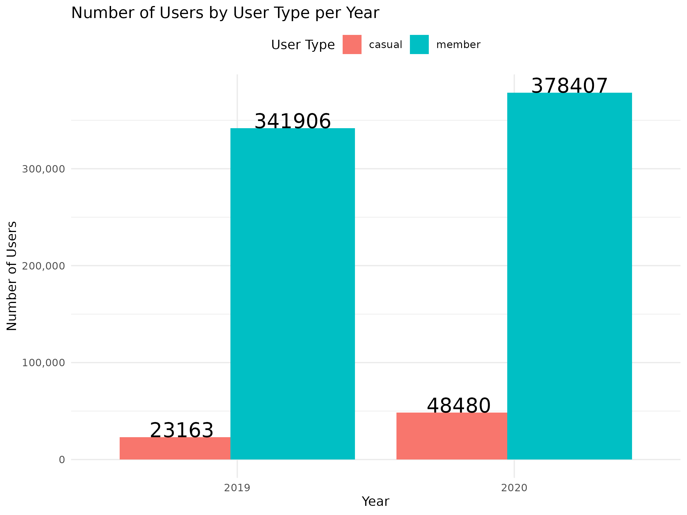

```{r setup, include=FALSE}
knitr::opts_chunk$set(echo = TRUE)
```

## Library Installation and Explanation

### `dplyr`

```{r echo=TRUE, eval=FALSE}
install.packages("dplyr")
library(dplyr)
```

This code installs and loads the dplyr package, which is part of the tidyverse collection. dplyr provides a set of tools for data manipulation in R. It allows you to:

-   Filter rows of data (filter()),

-   Select columns (select()),

-   Arrange data (arrange()),

-   Mutate data by creating new columns or modifying existing ones (mutate()),

-   Summarize data to get statistical summaries (summarize()).

### `ggplot2`

```{r echo=TRUE, eval=FALSE}
install.packages("ggplot2")
library(ggplot2)
```

ggplot2 is a powerful visualization package. It allows you to create complex and beautiful charts such as bar plots, line graphs, and scatter plots using a layered approach.

### `here`

```{r echo=TRUE, eval=FALSE}
install.packages("here")
library(here)
```

The here package makes file paths easier to manage. It finds the root of your project automatically, helping you avoid hard-coded pat

### `skimr`

```{r echo=TRUE, eval=FALSE}
install.packages("skimr")
library(skimr)
```

skimr provides an easy way to view summary statistics of your dataset, such as min, max, mean, and number of missing values.

### `janitor`

```{r echo=TRUE, eval=FALSE}
install.packages("janitor")
library(janitor)
```

The janitor package helps clean messy data. For example, it can standardize column names and detect duplicate rows or missing values

### `scales`

```{r echo=TRUE, eval=FALSE}
install.packages("scales")
library(scales)
```

The scales package is mainly used with ggplot2 to format numbers, percentages, currency, and more in your charts.

### `lubridate`

```{r echo=TRUE, eval=FALSE}
install.packages("lubridate")
library(lubridate)
```

lubridate makes it easier to work with dates and times in R. You can extract or modify components like year, month, and day easily.

## Importing CSV Data

```{r echo=TRUE, eval=FALSE}
trip_data_2019 <- read_csv("Divvy_Trips_2019_Q1.csv")
trip_data_2020 <- read_csv("Divvy_Trips_2020_Q1.csv")
```

The code above loads two datasets into R using the read_csv() function from the readr package.

-   trip_data_2019 refers to the data from Divvy_Trips_2019_Q1.csv

-   trip_data_2020 refers to the data from Divvy_Trips_2020_Q1.csv

These datasets were downloaded from the following link: [Divvy Trip Data Repositoryn](https://divvy-tripdata.s3.amazonaws.com/index.html)

## Data Cleaning and Transformation

The following R code performs a series of data cleaning and transformation steps on the Divvy trip datasets for 2019 and 2020. This ensures the data is consistent, cleaned of missing values, and ready for analysis.

```{r echo=TRUE, eval=FALSE}
# Cleaning and processing 2019 data by updating usertype values
cleaned_data_2019 <- trip_data_2019 %>%
  select(trip_id, start_time, end_time, usertype) %>%  # Select necessary columns
  filter(!is.na(start_time) & !is.na(end_time) & !is.na(usertype)) %>%  # Remove rows with NA values
  mutate(
    # Calculate ride_length as the difference in time between start_time and end_time (in seconds)
    ride_length = as.numeric(difftime(end_time, start_time, units = "secs")),
    
    # Add day_of_week column based on start_time (day of the week)
    day_of_week = weekdays(as.Date(start_time)),
    
    # Replace usertype values: Subscriber becomes member, Customer becomes casual
    usertype = recode(usertype, "Subscriber" = "member", "Customer" = "casual")
  )

# Cleaning and processing 2020 data
cleaned_data_2020 <- trip_data_2020 %>%
  # Rename columns to match the 2019 dataset
  rename(
    trip_id = ride_id,
    start_time = started_at,
    end_time = ended_at,
    usertype = member_casual
  ) %>%
  # Select necessary columns
  select(trip_id, start_time, end_time, usertype) %>%
  # Remove rows with NA values in the required columns
  filter(!is.na(start_time) & !is.na(end_time) & !is.na(usertype)) %>%
  # Add ride_length and day_of_week columns
  mutate(
    # Calculate ride_length as the difference in time between start_time and end_time (in seconds)
    ride_length = as.numeric(difftime(end_time, start_time, units = "secs")),
    
    # Add day_of_week column based on start_time (day of the week)
    day_of_week = weekdays(as.Date(start_time))
  )

# Convert trip_id in both datasets to the same data type (character)
cleaned_data_2019 <- cleaned_data_2019 %>%
  mutate(trip_id = as.character(trip_id))

cleaned_data_2020 <- cleaned_data_2020 %>%
  mutate(trip_id = as.character(trip_id))

# Combine cleaned_data_2019 and cleaned_data_2020 into a single dataset
combined_data_2019_2020 <- bind_rows(cleaned_data_2019, cleaned_data_2020) %>%
  mutate(
    # Add a 'year' column extracted from the 'start_time' field
    year = format(start_time, "%Y"),
    
    # Add a 'ride_duration' column that converts 'ride_length' to HH:MM:SS format
    ride_duration = sprintf("%02d:%02d:%02d", 
                            ride_length %/% 3600,  # Hours
                            (ride_length %% 3600) %/% 60,  # Minutes
                            ride_length %% 60)  # Seconds
  )

```

Now the data is clean, unified across years, and enriched with additional columns like day_of_week, ride_length, ride_duration, and year. These will be useful for further analysis and visualization.

## Visualization of Users by User Type per Year

```{r echo = FALSE}
# Menampilkan gambar yang telah disimpan

```

As shown in the data, in both 2019 and 2020, the number of casual users significantly surpassed that of members, with a considerable gap between the two groups. This trend highlights the dominance of casual users in comparison to registered members during these years.

## Visualization Ride Duration vs Day of the Week by User Type

```{r echo = FALSE}
# Menampilkan gambar yang telah disimpan

```

### Casual Users:
* The longest ride durations for casual users occur on Thursdays, Fridays, Sundays, and Wednesdays.

* The peak ride duration is observed on Thursday, reaching almost 50 minutes on average.

* This suggests that casual users tend to take longer rides closer to or during the weekend, possibly for leisure or recreational purposes.

### Member Users:
* The longest ride durations for members are recorded on Mondays, Tuesdays, and Saturdays.

* The highest average for member users is seen on Tuesday, with a duration close to 30 minutes.

* This pattern may reflect more consistent, utility-based use such as commuting or routine travel.

### Comparison Between User Types:
* Casual users consistently have longer ride durations compared to member users across most days.

* The difference in ride duration between casual and member users is especially noticeable on weekends and Thursdays.

* Member ride durations are relatively stable and shorter, indicating a more predictable usage pattern.

### Overall Insight:
* Members may be using the service more for commuting or quick trips, reflected in shorter and steadier durations throughout the week.

## Conclusion
* The analysis reveals a significant difference in ride behavior between casual and member users.

* Casual users consistently take longer rides, especially on Thursdays, Fridays, and weekends, often reaching up to 50 minutes.

* In contrast, member users have shorter and more consistent ride durations, likely due to routine commuting.

## Implication
* Since casual users ride for longer durations, there is an opportunity to encourage them to convert to membership.

* One potential strategy is to offer a membership discount or promotion for casual users who often exceed a certain ride duration (e.g., more than 30 minutes).

* This could provide better value for users while increasing the number of registered members and enhancing user retention.